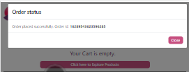

`## Application URL - `https://sakurastorefront.netlify.app

## Sakura

The application uses following libraries to create an single page application:

- react
- redux
- react-redux
- redux-observable
- react-bootstrap
- service workers
- aws amplify

## Performance

- Precaching
- workbox-cacheable-response

## Env Variables and their implications

Following environment variables needs to be defined in ".env.development" and ".env.production" as per the use-case:

REACT_APP_API_URL=/api
REACT_APP_COGNITO_REGION=
REACT_APP_USER_POOL_ID=
REACT_APP_USER_POOL_WEB_CLIENT_ID=
REACT_APP_COGNITO_DOMAIN=
REACT_APP_SIGNIN_REDIRECT=https://sakurastorefront.netlify.app/
REACT_APP_SIGNOUT_REDIRECT=https://sakurastorefront.netlify.app/

# Screenshots

|                                 |                                 |
| :-----------------------------: | :-----------------------------: |
|      |       |
|    |      |
|  |       |
|   |      |
|       |    |
|      |  |
|       |   |

